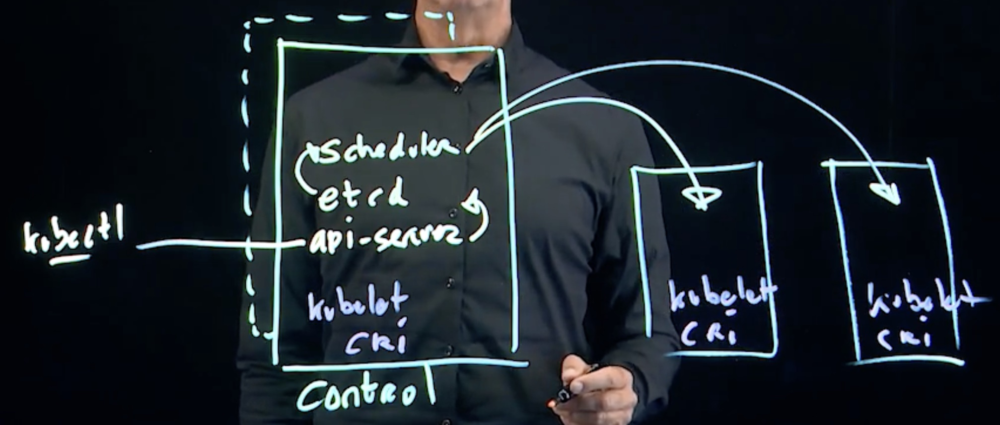

# Cloud native Computing

* Providing access to applications on the Internet, the application should be hosted in cloud
* The application is decoupled from specific servers
* Facilities (resources) introduced since it is decoupled
  * Access to configuration
  * Persistent Storage
  * Application access

# K8s origin

* Google Borg
* In June 2014 Kubernetes was announced and the source code donated to Cloud Native Computing Foundation in 2015

# Kubernetes architecture

* Control pane consists of one or more nodes where the Kubernetes core services are running
  * kube-apiserver: provides access to the API
  * etc: the Kubernetes DB
  * kube-scheduler:  responsible for Pod scheduling at a specific location
  * Kube-controller-manager: manages core Kubernetes processes
* The worker nodes run the containerized applications by using two core services
  * container runtime interface (cri): runs the containers
  * kubelet: the part that is contacted by the kube-scheduler to run the actual containers on Pods



# API resources

* Allow store and running applications in a K8s environment
* Essential ones include:
  * Pod: The minimal entity managed by Kubernetes. Runs containers
  * Deployment: adds replication and zero-downtime updates to Pods
  * ConfigMap: used to store configuration files and startup parameters. Secret are base64 encoded information (pwd for examples)
  * Services: load balances incoming traffic to application instances
  * Ingress/Gateway API: provides a reverse proxy for application access
  * Persistent Volumes: represent persistent non-ephemeral storage


# Lab

```
# Resources available
kubectl api-resources

# Man for resources
kubectl explain pod
kubectl explain pod.spec
```
