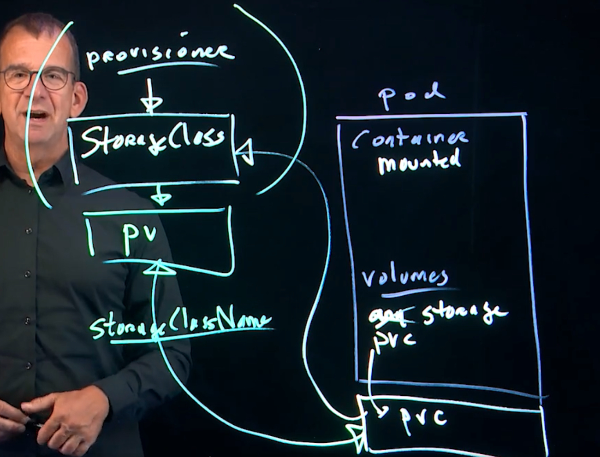

# Ephemeral Storage

* When a container is started, the container working environment is created as a directory on the host that runs the container
* In this directory, a subdirectory is created to store changes inside the container
* This subdirectory is ephemeral and disappears when the container disappears
* The ephemeral storage is host-bound, and that doesn't work well in a cloud environment where multiple application instances are running

# Cloud storage needs

* To provide persistent storage, the data needs to be store separately
* Cloud storage should not be host-bound (can be accessed just from one instance)
* When cloud storage is host-bound, it needs to be synchronized when replicated Pods run on different nodes
* Pos volumnes are a Pod property that allow containers to connect to ant storage type that is defined within the Pod
* Persistent volumes are independent API resources and can be discovered dynamically while running Pods

# Configuring Pod Volume Storage

* Defined as properties of the Pods
* Many types of storage can be addressed using volumes **kubectl explain pod.spec.volumes**
* Using Pod volumes works if Pods are used in an environment where a specific type of storage is used
* For more flexibility, PersistentVolumes can be used
* To use a Pod volume, the container needs to mount it, using **pod.spec.containers.volumeMounts**
* No easy command to create a Pod with volumes, use the documentation to set it up

# Common Pod volume types

* **emptyDir** creates a temporary directory on the host that runs a Pod and is ephemeral
* **hostPath** persistent directory on the host that runs the Pod
* **PersistenceVolumeClaim** connects to available PersistentVolumes
* **fc** (Fibre Channel) or **iscsi** may make more sense in real life but require additional setup (not covered on CKAD)

# Example
```
> kucetl apply -f podvolume.yaml
> kubectl describe po redis
...
Volumes:
  redis-storage:
    Type:       EmptyDir (a temporary directory that shares a pod's lifetime)
    Medium:
    SizeLimit:  <unset>

> kubectl exec -it redis -- touch /data/redis/helloworld
> kubectl exec -it redis -- ls -la /data/redis
total 8
drwxrwxrwx 2 redis root  4096 Oct 12 08:53 .
drwxr-xr-x 3 redis redis 4096 Oct 12 08:50 ..
-rw-r--r-- 1 root  root     0 Oct 12 08:53 helloworld

# tmp content deleted from host since it is ephemeral
> kubectl delete --force pod redis
```

# Understanding Persistence Storage

* A pod volume can use a persistent storage type
* A PersistentVolume is a specific API resource that defines storage, it is not a persistent storage type
* Pods connect to PersistentVolumes using the PersistentVolumeClaim API resource
* The benefit of using PersistentVolumes is decoupling: the Pod doesn't connect to a specific storage type, but will pick up what is available 
* Usefull in DevOps environments, where different types of storage may be available for different environments

# Create PersistentVolumes

* There is no easy way to create PersistentVolumes from the command line: searcg for "Create a persistent volume"
* In many environments, PersistentVolumes are created automatically, using StorageClass resource and an automatic storage provisioner
* When setting up PersistentVolumes manually, make sure they have the storageClassName property set

# Understanding storageClassName

* **storageClassName** can be used to group different types of storage:
  * Use **storageClassName:preprod** for preproduction storage
  * Use **storageClassName:preprod** for production storage
* The storageClassName property is also used for storage that has automatically been created by a StorageClass
* While requesting storage using the PersistentVolumeClaim, storageClassName must be specified to bing a specific type of storage



* A pvc may be directly connected to a StorageClass or a pv in which case StorageClassName needs to be provided

# Demo: Defining PersistentVolumes

```
> kubectl explain persistentvolume.spec.accessmodes
> kubectl apply -f pv-volume.yaml
persistentvolume/task-pv-volume created
> kubectl get pv
NAME                                       CAPACITY   ACCESS MODES   RECLAIM POLICY   STATUS      CLAIM                                 STORAGECLASS   VOLUMEATTRIBUTESCLASS   REASON   AGE
task-pv-volume                             10Gi       RWO            Retain           Available                                         manual         <unset>                          6s

> kubectl describe pv task-pv-volume
kubectl describe pv task-pv-volume
Name:            task-pv-volume
Labels:          type=local
Annotations:     <none>
Finalizers:      [kubernetes.io/pv-protection]
StorageClass:    manual
Status:          Available
Claim:
Reclaim Policy:  Retain
Access Modes:    RWO
VolumeMode:      Filesystem
Capacity:        10Gi
Node Affinity:   <none>
Message:
Source:
    Type:          HostPath (bare host directory volume)
    Path:          /mnt/data
    HostPathType:
Events:            <none>
```

* [Access Modes](https://kubernetes.io/docs/concepts/storage/persistent-volumes#access-modes)
  * **ReadWriteOnce** - the volume can be mounted as read-write by a single node. ReadWriteOnce access mode still can allow multiple pods to access the volume when the pods are running on the same node. For single pod access, please see ReadWriteOncePod
  * **ReadOnlyMany** the volume can be mounted as read-only by many nodes
  * **ReadWriteMany** the volume can be mounted as read-write by many nodes
  * **ReadWriteOncePod** the volume can be mounted as read-write by a single Pod. Use ReadWriteOncePod access mode if you want to ensure that only one pod across the whole cluster can read that PVC or write to it

# StorageClass

* Works with a storage provisioner to create PersistentVolumes on-demand
* Storage provisioners are not part of vanilla Kubernetes, they are provided by the ecosystem and may be integrated in a Kubernetes distribution
* The storage provisioner is an application that runs in Kubernetes to communicate with the site-specific storage to create on-demand
* Without storage provisioner, the StorageClass won't do anything

> Configuration of StorageClass not required for CKAD

```
> kubectl get storageclass
NAME                   PROVISIONER             RECLAIMPOLICY   VOLUMEBINDINGMODE      ALLOWVOLUMEEXPANSION   AGE
local-path (default)   rancher.io/local-path   Delete          WaitForFirstConsumer   false                  74d

> kubectl describe local-path

kubectl describe storageclasses.storage.k8s.io local-path
Name:                  local-path
IsDefaultClass:        Yes
Annotations:           defaultVolumeType=local,objectset.rio.cattle.io/applied=H4sIAAAAAAAA/4yRz47UMAyHXwX53JYpnamqSBxg0V4QEhJoObuJOzVN4ypxi0areXeUMqDhwJ9j8ov9xZ+fARd+ophYAhhIKhHPVE1dqlhebjUUMHFwYODTj+jBY0pQwEyKDhXBPAOGIIrKElI+Ohpw9fokfp3p82UhMODFoocCpP9KVhNpFVkqi6qeMokz4i+5fAsUy/M2gYGpSXfJVhcv3nNwr984J+GfLQLOv/5T3sb9r6K0oM2V09pTmS5JaYbipzCbrVQ5ioGUdnmcypuJco/BgMaV4FqAx5787upP3BHTCAbqrhmak21Pw9Db5tAe20MzHJuhPnUH19m2w1cOe3fMTX+bbEEd8+USZeO8XIpgIGKwI8UMuHtWQMwD8PxRPNsLGHhHnjRr2fYdvuXgOJw/iMuAL8j6KPGRY9IHCWmdKcL1ewAAAP//KQ1Ko0kCAAA,objectset.rio.cattle.io/id=,objectset.rio.cattle.io/owner-gvk=k3s.cattle.io/v1, Kind=Addon,objectset.rio.cattle.io/owner-name=local-storage,objectset.rio.cattle.io/owner-namespace=kube-system,storageclass.kubernetes.io/is-default-class=true
Provisioner:           rancher.io/local-path
Parameters:            <none>
AllowVolumeExpansion:  <unset>
MountOptions:          <none>
ReclaimPolicy:         Delete
VolumeBindingMode:     WaitForFirstConsumer
Events:                <none>
```

# Configuring Pod Storage

* Within the Pod, you'll configure a volume that uses the persistentVolumeClaim type
* This volume is mounted using the volumeMounts container property
* The PersistentVolumeClaim is defined separately you might want to include it in the same YAML file

```
> kubectl apply -f pv-pod.yaml
# No claim created yet
> kubectl get po

NAME          READY   STATUS    RESTARTS   AGE
redis         1/1     Running   0          80s
task-pv-pod   0/1     Pending   0          36s

> kubectl apply -f pv-claim.yaml
> kubectl get po
NAME          READY   STATUS    RESTARTS   AGE
task-pv-pod   1/1     Running   0          3m29s

> kubectl describe po task-pv-pod

....
Volumes:
  task-pv-storage:
    Type:       PersistentVolumeClaim (a reference to a PersistentVolumeClaim in the same namespace)
    ClaimName:  task-pv-claim
    ReadOnly:   false 
```

# Lab Setting up storage

```
> kubectl apply -f labpv.yaml
> kubectl apply -f labpvc.yaml
> kubectl get pv,pvc

IEJ2XXQV45JF:7.Storage hjue0001$ kubectl get pv,pvc
NAME                                                        CAPACITY   ACCESS MODES   RECLAIM POLICY   STATUS   CLAIM                                 STORAGECLASS   VOLUMEATTRIBUTESCLASS   REASON   AGE
persistentvolume/lab7pv                                     10Gi       RWX            Retain           Bound    default/lab7pvc                       manual         <unset>                          2m35s

NAME                                                STATUS   VOLUME                                     CAPACITY   ACCESS MODES   STORAGECLASS   VOLUMEATTRIBUTESCLASS   AGE
persistentvolumeclaim/task-pv-claim                 Bound    task-pv-volume                             10Gi       RWO            manual         <unset>                 8m33s

> kubectl cp -h | less
> kubectl apply -f labpod.yaml
> kubectl cp /etc/hosts lab7pod:/data
> kubectl exec -it lab7pod -- ls -la /data

total 8
drwxr-xr-x    2 root     root            60 Oct 12 10:09 .
drwxr-xr-x    1 root     root          4096 Oct 12 10:09 ..
-rw-r--r--    1 root     wheel          252 Oct 12 10:09 hosts
```